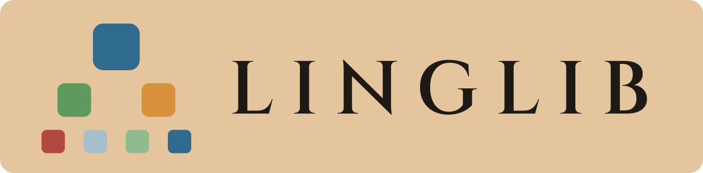

<p align="center">
  
</p>

[](https://github.com/hawkrobe/linglib/actions/workflows/ci.yml)
[](https://leanprover.github.io/)
[](https://github.com/leanprover-community/mathlib4)
[](LICENSE)

A Lean 4 library for formal linguistics across semantics, syntax, pragmatics, morphology, phonology, and processing.

> ⚠️ Among other things, this repository is an experiment in "AI for Linguistics" using recent advances in proof assistants and autoformalization. If you find any inaccuracies or errors, please [open an issue](https://github.com/hawkrobe/linglib/issues)! 

## Overview

Linglib aims to provide for linguistic theory what mathlib provides for mathematics: a machine-verified library where theories can be formalized against shared definitions and tested against a shared body of data. 

- - **Make theories fully explicit.** In practice, theoretical proposals involve some amount of hand-waving, leaving gaps between what is claimed and what actually follows from the definitions. Lean checks predictions as theorems and if the consequences don't follow, the code doesn't compile. 

- **Detect breakage.** Because every study imports a shared library, tweaking your semantics for (say) attitude verbs tells you exactly which downstream results about conditionals, questions, or implicature still go through, and which were silently sensitive to this choices. This is like a "regression test" for theory. 

- **Compare theories.** We can formally characterize where theories agree and where they diverge (and the divergence points highlight predictions where further data could be collected.)

## Building

```bash
lake exe cache get  # Get mathlib cache
lake build
```

## Using Linglib in your own Lake project

Linglib pins a specific toolchain (currently **Lean v4.34.0 / mathlib v4.34.0**), so your project's `lean-toolchain` must match. Add to your `lakefile.lean`:

```lean
require linglib from git
  "https://github.com/hawkrobe/linglib" @ "v4.33.1"
```

(Use `@ "main"` to track the latest development instead of the pinned release.)

Then `import Linglib` — or, more selectively, e.g. `import Linglib.Pragmatics.RSA.Basic`.

## Links

- **Project site & API docs:** [linglib.io](https://linglib.io/) — also hosts the blog, an interactive dependency map, and the bibliography.
- **Contributing:** see [CONTRIBUTING.md](CONTRIBUTING.md).

## License

Apache 2.0 — see [LICENSE](LICENSE).
